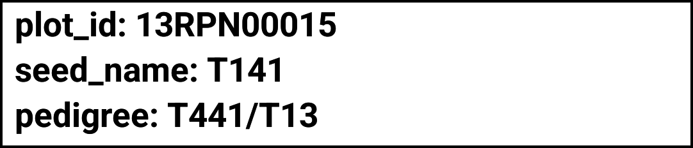
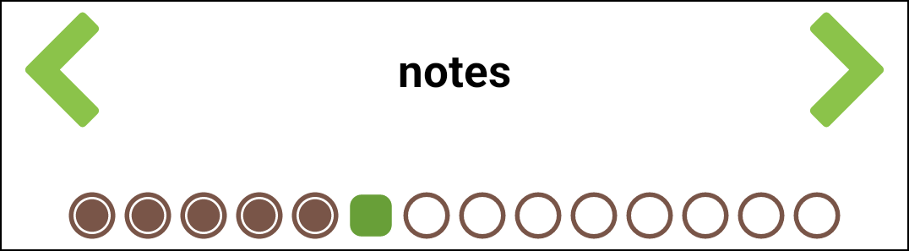
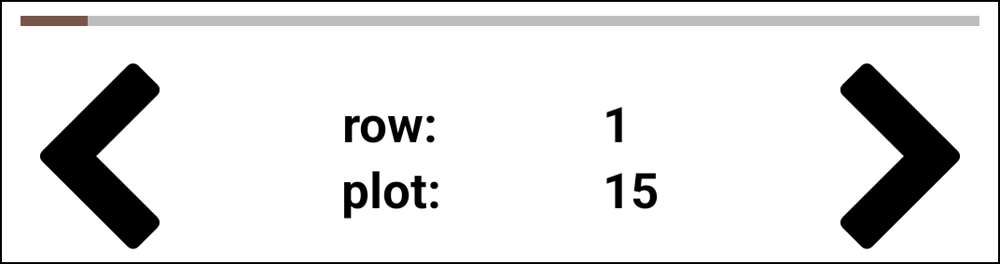

<link rel="stylesheet" type="text/css" href="_styles/styles.css">

# Collect

## Overview

Field Book aims to increase the rate at which data can be collected by tailoring the input screen to fit the exact task.
Only a single entry and trait are visible at a time during collection.
This reduces the risk of error and allows trait-specific layouts to be used for data input.

The small green arrows are used to navigate between traits.
A line of dots below the arrows represent the individual traits, and the progression through them for the current entry.

The large black arrows are used to navigate between entries.
The progress bar above them indicates progress through the entries.

Data is entered in the bottom area of the screen using a layout determined by the current trait.
Entered values turn from black to red once they have been saved to Field Book's internal database.

<figure class="image">
   
  <figcaption class="screenshot-caption"><i>Data collection screen</i></figcaption> 
</figure>

## Collect Screen Details

#### Top toolbar

By default there are four buttons at the top of the screen (in addtion to the back navigation arrow).

<figure class="image">
   
  <figcaption class="screenshot-caption"><i>Collect screen with the top toolbar highlighted</i></figcaption> 
</figure>

-    **Search** opens a dialog to search for a specific entry.

<figure class="image" class="screenshot">
   
  <figcaption class="screenshot-caption"><i>The collect screen search tool</i></figcaption> 
</figure>

The search dialog provides a flexible interface to search for specific entries.
Populate the search menu by pressing the  icon, and selecting from the list of attributes, traits, or other columns.
Once a search column is added you can enter a search string on it's blank text entry line.
Press the  icon if you'd like to change the operator from "equals" to "contains", or numeric operators like ">" or "<".
Press the  icon to remove a column.
Add as many search columns as you like, then press search.
The search will return a table of matching results, press any line in the results table to jump to that entry.

-  **Resources** opens the `resources` folder and can be used to load reference images.
Long press the icon to jump directly to the most recently loaded file, rather than the file picker.

-  **Summary** opens a dialog that displays all info for the current entry.

<figure class="image">
   
  <figcaption class="screenshot-caption"><i>The collect screen summary tool</i></figcaption> 
</figure>

Summary shows detailed information for the current entry.
Arrows at the bottom navigate forwards or backwards to other entries.
By default the summary shows all of the imported data fields from the field file, but none of the collected trait values.
Pressing the edit icon in the top toolbar opens a dialog to customize which data fields and traits are shown.
Selecting a trait from the summary screen navigates to that trait.

 **Lock** adds restrictions on data input to prevent accidental changes. Pressing the icon multiple times will cycle through three states:
-    **Unlocked** is the default, unfrozen state that allows trait values to be entered, edited, or deleted.
-    **Locked** freezes the collect input so no values can be entered, modified, or deleted.
-    **Limited** freezes existing data but allows entry of new values.

More tools can be added to the toolbar in the  [Features Settings](settings-features.md).
Default tools can be removed from the toolbar in  [Appearance Settings](settings-appearance.md).

#### InfoBars

<figure class="image">
   
  <figcaption class="screenshot-caption"><i>The collect screen InfoBar section</i></figcaption> 
</figure>

InfoBars display information about the current plot.
InfoBar prefixes can be pressed to adjust which data field is displayed.

<figure class="image">
   
  <figcaption class="screenshot-caption"><i>Customizing the infoBar section</i></figcaption> 
</figure>

An infobar can show one of the attributes imported with the field, or the value of a trait.
The number of infobars can also be changed by pressing "customize" in the bottom left of the dialog, this navigates the the "numnber of infobars" preference in the  [Appearance Settings](settings-appearance.md).

If an infobar's value gets cut off because it is too long to fit on one line you can longpress it to enable word wrap.
When word wrap in on, any long values for that infobar will automatically wrap to the next line.
Longpress a wrapped infobar again to disable word wrap.

<figure class="image">
   
  <figcaption class="screenshot-caption"><i>Enabling word wrap for long pedigree strings</i></figcaption> 
</figure>

#### Trait navigation

<figure class="image">
   
  <figcaption class="screenshot-caption"><i>The collect screen trait navigation section</i></figcaption> 
</figure>

The small, green arrows are used to move between the different traits that are currently active.
Pressing the current trait will show a dialog of all currently active traits, select a different trait to jump to it.

<figure class="image">
   
  <figcaption class="screenshot-caption"><i>Pressing the active trait to see the trait dialog</i></figcaption> 
</figure>

#### Entry navigation

<figure class="image">
   
  <figcaption class="screenshot-caption"><i>The collect screen entry navigation section</i></figcaption> 
</figure>

The large, black arrows navigate between different entries.
Pressing and holding these arrows will continuously scroll.
The longer the arrows are pressed, the faster the scrolling becomes.

#### Data input

The bottom half of the screen is used to input data.
The elements and layout of this area change based on the trait that is currently active.
Information for each specific trait format can be found in the Trait Formats pages.

#### Bottom toolbar

The bottom toolbar contains three buttons for data input:

-    enters data by scanning a barcode.
-    enters NA for when a phenotype is not available.
-    deletes the entered data.