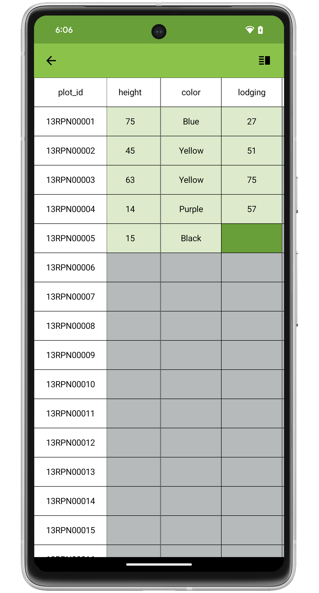

<link rel="stylesheet" type="text/css" href="_styles/styles.css">

Datagrid
========

Overview
--------

DataGrid is accessed by pressing the  icon in the toolbar.
DataGrid displays a matrix of entries and traits in the active field.
This view allows rapid identification of missing values.
Pressing an individual cell moves the collect screen directly to the corresponding entry and trait.

<figure class="image">
   
  <figcaption class="screenshot-caption"><i>The Datagrid tool, showing a grid of entries, traits, and collected values</i></figcaption> 
</figure>

Settings
--------

The column used for the row header can be changed by pressing the  icon in the toolbar, then selecting a different attribute to use.

<figure class="image">
   
  <figcaption class="screenshot-caption"><i>Changing the row header from plot_id to plot</i></figcaption> 
</figure>