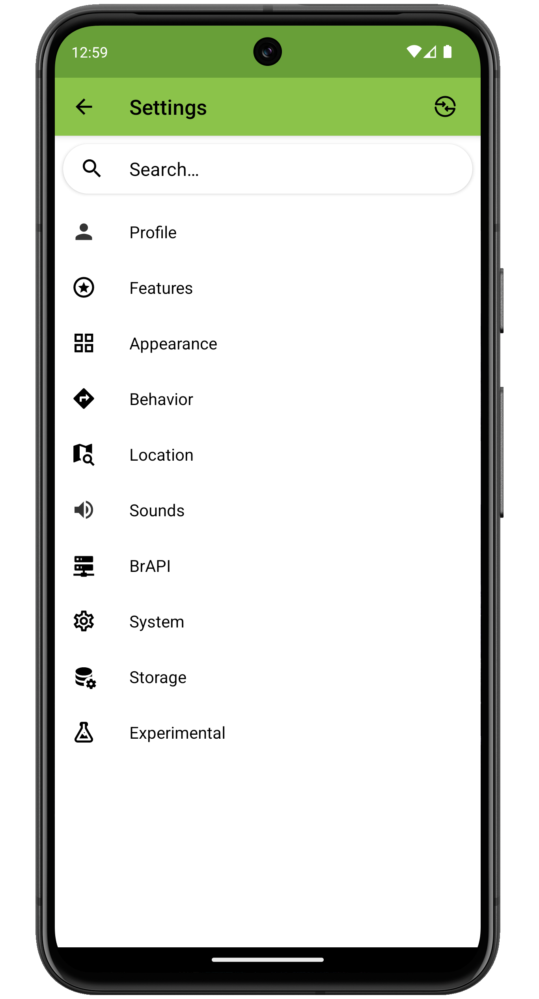

Settings
========

<figure align="center" class="image">
   
  <figcaption><i>Settings screen layout</i></figcaption> 
</figure>

Field Book settings are grouped into eight subcategories:

-    [Profile Settings](settings-profile.md) set the identity of the person collecting data.
-    [Appearance Settings](settings-appearance.md) change language, app colors, icons, or layouts.
-    [Features Settings](settings-features.md) add or remove toolbar features
-    [Behavior Settings](settings-behavior.md) change default collect actions.
-    [Location Settings](settings-location.md) modify location details and manage geonavigation.
-   [Sound Settings](settings-sound.md) toggle sound notifications for collection activities.
-    [Brapi Settings](settings-brapi.md) connect to an external data source using the Breeding API (BrAPI).
-    [System Settings](settings-system.md) change import, export, anfd file-sharing defaults.
-    [Storage Settings](settings-storage.md) modify storage location and import, export, or reset database.
-    [Experimental Settings](settings-experimental.md) manage new features that are not enabled by default.

The  **Search Bar** at the top of the screen can be used to quickly find and navigate to a specific setting.

<figure align="center" class="image">
   
  <figcaption><i>Searching for a specific setting</i></figcaption> 
</figure>
